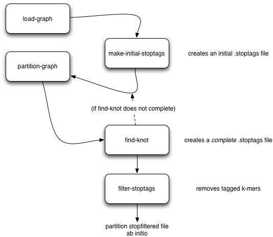

..
   This file is part of khmer, https://github.com/dib-lab/khmer/, and is
   Copyright (C) 2010-2015 Michigan State University
   Copyright (C) 2015 The Regents of the University of California.
   It is licensed under the three-clause BSD license; see LICENSE.
   Contact: khmer-project@idyll.org
   
   Redistribution and use in source and binary forms, with or without
   modification, are permitted provided that the following conditions are
   met:
   
    * Redistributions of source code must retain the above copyright
      notice, this list of conditions and the following disclaimer.
   
    * Redistributions in binary form must reproduce the above
      copyright notice, this list of conditions and the following
      disclaimer in the documentation and/or other materials provided
      with the distribution.
   
    * Neither the name of the Michigan State University nor the names
      of its contributors may be used to endorse or promote products
      derived from this software without specific prior written
      permission.
   
   THIS SOFTWARE IS PROVIDED BY THE COPYRIGHT HOLDERS AND CONTRIBUTORS
   "AS IS" AND ANY EXPRESS OR IMPLIED WARRANTIES, INCLUDING, BUT NOT
   LIMITED TO, THE IMPLIED WARRANTIES OF MERCHANTABILITY AND FITNESS FOR
   A PARTICULAR PURPOSE ARE DISCLAIMED. IN NO EVENT SHALL THE COPYRIGHT
   HOLDER OR CONTRIBUTORS BE LIABLE FOR ANY DIRECT, INDIRECT, INCIDENTAL,
   SPECIAL, EXEMPLARY, OR CONSEQUENTIAL DAMAGES (INCLUDING, BUT NOT
   LIMITED TO, PROCUREMENT OF SUBSTITUTE GOODS OR SERVICES; LOSS OF USE,
   DATA, OR PROFITS; OR BUSINESS INTERRUPTION) HOWEVER CAUSED AND ON ANY
   THEORY OF LIABILITY, WHETHER IN CONTRACT, STRICT LIABILITY, OR TORT
   (INCLUDING NEGLIGENCE OR OTHERWISE) ARISING IN ANY WAY OUT OF THE USE
   OF THIS SOFTWARE, EVEN IF ADVISED OF THE POSSIBILITY OF SUCH DAMAGE.
   
   Contact: khmer-project@idyll.org

=========================================
Partitioning large data sets (50m+ reads)
=========================================

"Partitioning" is what khmer calls the process of separating reads
that do not connect to each other into different logical bins.  The
goal of partitioning is to apply divide & conquer to the process of
metagenomic assembly.

Basic partitioning
------------------

The basic workflow for partitioning is in the figure below:

.. image:: partitioning-workflow.png
   :width: 40%

Briefly, you load everything into khmer's probabilistic graph
representation; exhaustively explore the graph to find all
disconnected sequences; merge the results of the (parallelized) graph
exploration; annotate sequences with their partition; and then extract
the different partitions into files grouped by partition size.  These
groups can then be assembled individually.

Artifact removal
----------------

As part of our partitioning research, we discovered that large
Illumina data sets tend to contain a single large, connected
component.  This connected component seems to stem from sequencing
artifacts that causes knots in the assembly graph.  We have developed
tools to forcibly remove the knot at the heart of the graph.

Here's the workflow:

Running on an example data set
------------------------------

Here is a set of commands for running both basic partitioning and
artifact removal on a small soil metagenomics data set that we've
made available for this purpose.

The data set is about 1.1G and you can download it from here:

https://s3.amazonaws.com/public.ged.msu.edu/khmer/iowa-corn-50m.fa.gz

::

  cd /path/to/data
  
  # the next command will create a '50m.ct' and a '50m.tagset',
  # representing the de Bruijn graph
  load-graph.py -k 32 -N 4 -x 16e9 50m iowa-corn-50m.fa.gz
  
  # this will then partition that graph. should take a while.
  # update threads to something higher if you have more cores.
  # this creates a bunch of files, 50m.subset.*.pmap
  partition-graph.py --threads 4 -s 1e5 50m
  
  # now, merge the pmap files into one big pmap file, 50m.pmap.merged
  merge-partitions.py 50m
  
  # next, annotate the original sequences with their partition numbers.
  # this will create iowa-corn-50m.fa.gz.part
  annotate-partitions.py 50m iowa-corn-50m.fa.gz
  
  # now, extract the partitions in groups into 'iowa-corn-50m.groupNNNN.fa'
  extract-partitions.py iowa-corn-50m iowa-corn-50m.fa.gz.part
  
  # at this point, you can assemble the group files individually.  Note,
  # however, that the last one them is quite big?  this is because it's
  # the lump! yay!
  
  # if you want to break up the lump, go through the partitioning bit
  # on the group file, but this time with a twist:
  mv iowa-corn-50m.group0005.fa corn-50m.lump.fa
  
  # create graph,
  load-graph.py -x 8e9 lump corn-50m.lump.fa

  # create an initial set of stoptags to help in knot-traversal; otherwise,
  # partitioning and knot-traversal (which is systematic) is really expensive.
  make-initial-stoptags.py lump

  # now partition the graph, using the stoptags file
  partition-graph.py --stoptags lump.stoptags lump

  # use the partitioned subsets to find the k-mers that nucleate the lump
  find-knots.py -x 2e8 -N 4 lump

  # remove those k-mers from the fasta files
  filter-stoptags.py *.stoptags corn-50m.lump.fa

  # now, reload the filtered data set in and partition again.
  # NOTE: 'load-graph.py' uses the file extension to determine
  # if the file is formatted as FASTA or FASTQ. The default is
  # fasta, therefore if your files are fastq formatted you need
  # to append 'fastq' to the name so that 'load-graph.py'
  # will parse the file correctly
  load-graph.py -x 8e9 lumpfilt corn-50m.lump.fa.stopfilt
  partition-graph.py -T 4 lumpfilt
  merge-partitions.py lumpfilt
  annotate-partitions.py lumpfilt corn-50m.lump.fa.stopfilt
  extract-partitions.py corn-50m-lump corn-50m.lump.fa.stopfilt.part

  # and voila, after all that, you should now have your de-knotted lump in
  # corn-50m-lump.group*.fa.  The *.group????.fa files can now be
  # assembled individually by your favorite assembler.

Post-partitioning assembly
--------------------------

The 'extract-partitions' script takes reads belonging to each
partition and aggregates them into 'group' files; each group file
contains at least one entire partition (and generally a lot more).
Note, you can control the number of reads in each file (equiv, the
size of these files) with some of the arguments that
'extract-partitions' takes.

Now that you have these files... what do you do with them?  The short
answer is: assemble them!  Each of these group files contains reads
that do not connect to reads in other files, so the files can be
assembled individually (which is the whole point of partitioning).

If you're using Velvet, checkout the ``sandbox/velvet-assemble.sh`` script,
which you can run like this::

   bash /path/to/khmer/sandbox/velvet-assemble.sh <groupfile> <k>

This script does three things:

 - first, it breaks the reads up into paired reads and single reads,
   and puts them in separate files (.pe and .se);

 - second, it strips off the partition information from the reads,
   which confuses Velvet;

 - and third, it runs velveth and velvetg to actually assemble.

You can implement your own approach, of course, but this is an example of
what we do ourselves.
